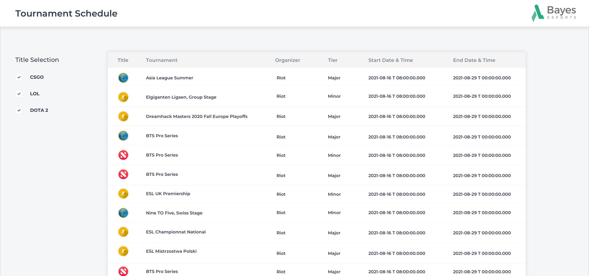

# Bayes Frontend Challenge

Welcome to our frontend developer challenge. We ask you to complete a few small tasks within this existing project to learn more about your skills. The tasks are designed to be solvable in around 2-3 hours.

## The Project

We have prepared a small scaffold based on a standard create-react-app setup with familiar npm scripts like `npm start` and `npm test`.

The goal of the project is to load tournaments from an API which are selected by esports titles and display them in a table view. The API is implemented as a mock, returning demo data, here.

Feel free to modify any of the source file (also the existing ones) or add new files.

## Tasks

1. Trigger loading tournaments for the selected esports titles when the corresponding checkboxes are checked. Implement a custom hook that loads the selected tournaments with the `loadTournaments()` function in the `api/tournamentApi` module.
1. Render the current tournament results in a table that looks as shown in the following design. You can find all required colors and assets in the project. Implement a separate component for the table.
   
1. Show a loading indicator while tournaments are being loaded. You can use the existing `Spinner` component for that purpose.
1. Complete the test stubs in `App.test.tsx`.
